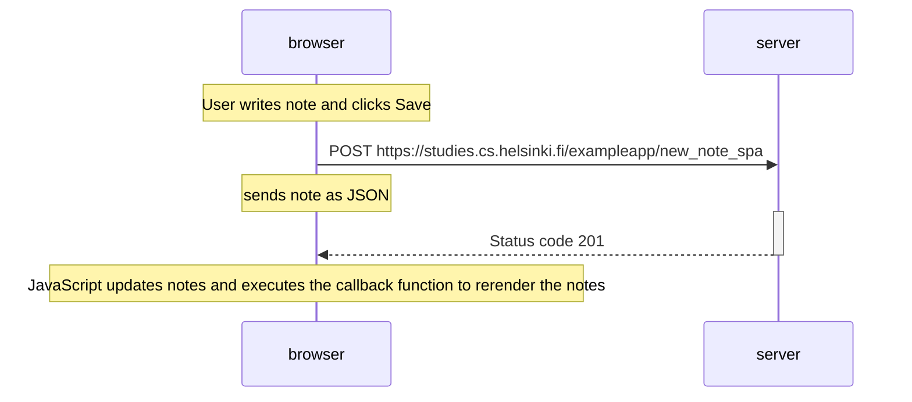

```mermaid
sequenceDiagram
    participant browser
    participant server

    Note over browser: User writes note and clicks Save

    browser->>server: POST https://studies.cs.helsinki.fi/exampleapp/new_note_spa
    Note over browser: sends note as JSON
    activate server
    server-->>browser: Status code 201
    deactivate server
    
    Note over browser: JavaScript updates notes and executes the callback function to rerender the notes 
```